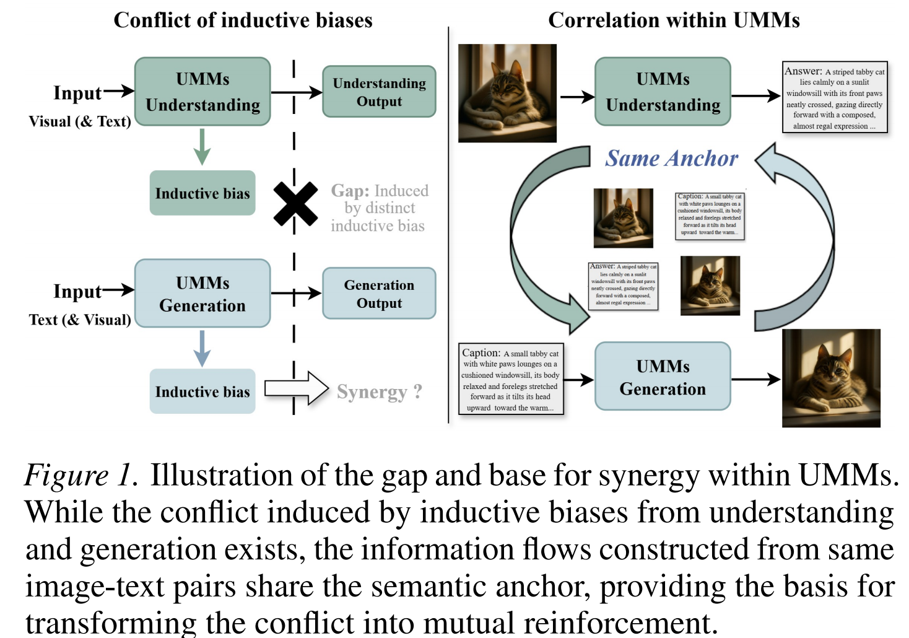
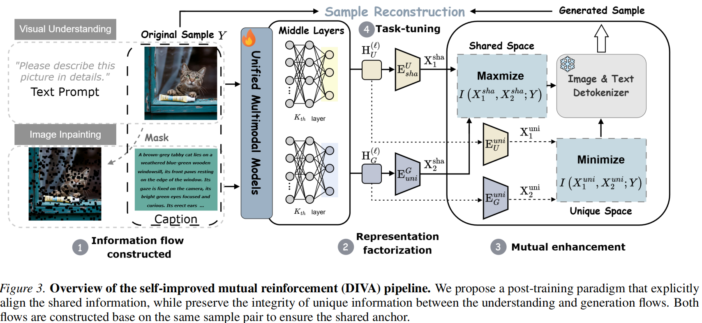
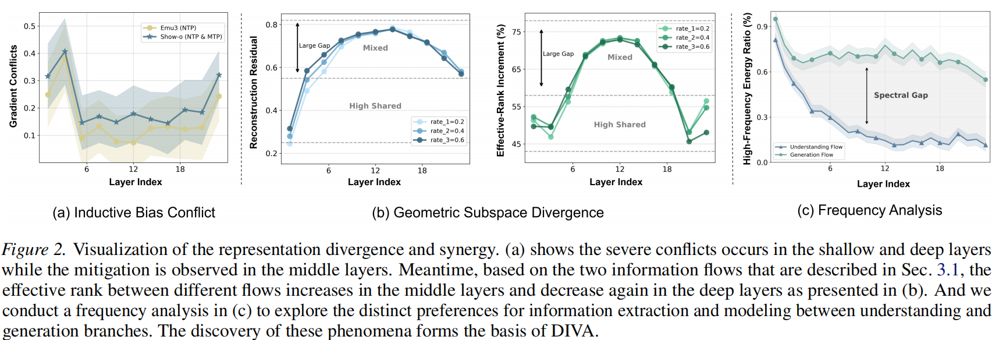
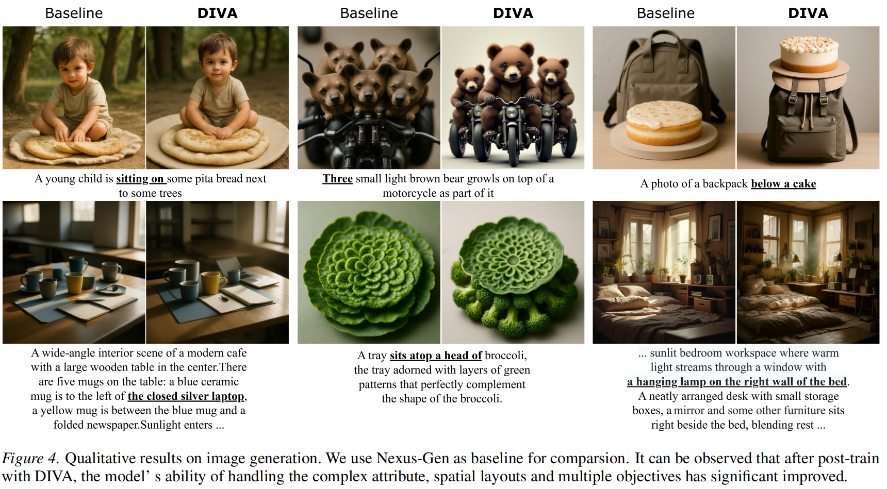
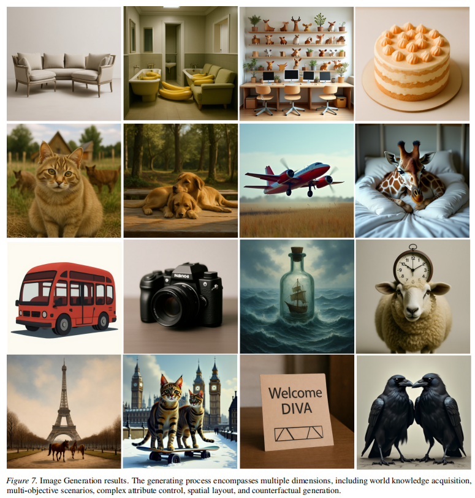

# DIVA: Harnessing the Representation Divergence in Unified Multimodal Models for Mutual Reinforcement

<p align="center">
  <a href="#"></a>
  <a href="#"></a>
  <a href="#"></a>
  <a href="#"></a>
</p>

This repository hosts the official project page and upcoming implementation for **DIVA**, a self-improved post-training framework for unified multimodal models (UMMs). The current release is a paper showcase while we clean and package the code, data recipes, and checkpoints for public release.

> **Repository status.** The implementation is being organized for a reproducible release. We will open-source the project progressively instead of publishing a partial code dump.

## Links

| Resource | Status |
| --- | --- |
| Paper | Coming soon |
| Project page | Coming soon |
| Training code | Planned |
| Post-training data recipe | Planned |
| Checkpoints | Planned |
| Evaluation scripts | Planned |

## Core Idea

Unified multimodal models aim to handle both visual understanding and image generation within a shared architecture. DIVA starts from a simple observation: these two capabilities are not naturally optimized by the same representation.

- **Understanding** prefers semantic, discriminative, and task-invariant representations.
- **Generation** prefers high-fidelity, fine-grained, reconstruction-sensitive representations.
- Training both objectives in one monolithic backbone can therefore create representation conflict.

DIVA turns this conflict into mutual reinforcement. For the same image-text pair, we construct two task-induced information flows, factorize their middle-layer visual representations into **shared** and **unique** components, align the shared space, and protect task-specific information from cross-flow interference.



## Method Overview



DIVA is a post-training framework with three main ingredients:

1. **Task-induced information flows.** We build an understanding flow through image captioning and a generation flow through image inpainting, both anchored by the same image-text sample.
2. **Shared/unique factorization.** Middle-layer image-token states are mapped into shared factors and unique factors, separating cross-task transferable information from branch-specific information.
3. **Mutual-information based training.** DIVA maximizes shared information across flows while suppressing leakage between unique factors, enabling understanding and generation to improve together.

The representation analysis below motivates the design: conflicts are strongest in shallow and deep layers, while middle layers expose useful subspace divergence that can be factorized and reused.



## Results

DIVA consistently improves both understanding and generation across three unified multimodal baselines.

| Model | MMMU | MME | POPE | GenEval | DPG-Bench | WISE |
| --- | ---: | ---: | ---: | ---: | ---: | ---: |
| Nexus-Gen | 43.5 | 1279.1 | 83.6 | 0.77 | 81.30 | 0.39 |
| Nexus-Gen + DIVA | **49.4 (+5.9)** | **1355.3 (+76.2)** | **87.4 (+3.8)** | **0.83 (+0.06)** | **87.87 (+6.57)** | **0.45 (+0.06)** |
| Show-o | 26.3 | 1097.7 | 73.1 | 0.57 | 69.81 | 0.29 |
| Show-o + DIVA | **32.4 (+6.1)** | **1206.1 (+108.4)** | **79.1 (+6.0)** | **0.64 (+0.07)** | **76.03 (+6.22)** | **0.34 (+0.05)** |
| Liquid | 30.2 | 1321.7 | 77.4 | 0.70 | 80.63 | 0.41 |
| Liquid + DIVA | **34.0 (+3.8)** | **1434.9 (+113.2)** | **84.5 (+7.1)** | **0.81 (+0.11)** | **83.47 (+2.84)** | **0.44 (+0.03)** |

### Ablation

On Show-o, standard supervised fine-tuning on the same data brings only marginal gains, while DIVA provides consistent improvement across understanding and generation metrics.

| Configuration | MMMU | POPE | GenEval | DPG-Bench |
| --- | ---: | ---: | ---: | ---: |
| Base | 26.3 | 73.1 | 0.69 | 69.81 |
| Base + SFT | 26.8 | 74.5 | 0.67 | 70.75 |
| Base + DIVA | **32.4** | **79.1** | **0.75** | **76.03** |

## Qualitative Examples

After DIVA post-training, the model handles complex attributes, spatial layouts, multi-object prompts, and detailed object relationships more reliably.



Additional generation examples from the appendix:

<p align="center">
  
</p>

## Open-Source Roadmap

We are preparing the repository in stages so that each release is usable and verifiable.

- [x] **Phase 0: Paper showcase.** README, key figures, result tables, and citation placeholder.
- [ ] **Phase 1: Evaluation release.** Benchmark scripts, preprocessing utilities, metric wrappers, and reproduction commands for understanding and generation evaluation.
- [ ] **Phase 2: Data release.** Post-training data construction recipe, filtering rules, caption-generation pipeline, mask-generation utilities, and train/validation split metadata.
- [ ] **Phase 3: Training code.** DIVA factorization modules, stage-1 encoder warmup, stage-2 backbone fine-tuning, DeepSpeed configs, and model-specific configs for Nexus-Gen, Show-o, and Liquid.
- [ ] **Phase 4: Checkpoints.** Factorization encoders, post-trained checkpoints, model cards, and inference examples.
- [ ] **Phase 5: Extended applications.** Image editing examples, notebooks, troubleshooting notes, and additional qualitative results.

## Planned Repository Layout

```text
DIVA/
  assets/                  # Figures used by this README
  configs/                 # Model and training configs
  data/                    # Data construction and filtering utilities
  diva/                    # DIVA modules
  scripts/                 # Training, evaluation, and inference scripts
  README.md
```

## Citation

If you find this work useful, please cite:

```bibtex
@inproceedings{diva2026,
  title     = {DIVA: Harnessing the Representation Divergence in Unified Multimodal Models for Mutual Reinforcement},
  author    = {Author Names},
  booktitle = {International Conference on Machine Learning},
  year      = {2026}
}
```

## Contact

For questions, please open an issue in this repository. Project links, authors, license, and release details will be updated with the camera-ready public version.
